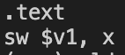
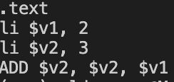
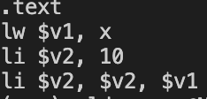
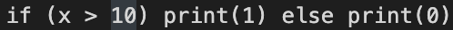
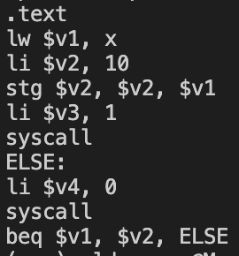

# Tarea Compilador Generador Basico
## Input que se acepta

    int x
    2 + 3
    x = 10
    if (x > 10) print(1) else print(0)
### Sirve mejor si cada uno se ejecuta individual

## Resultados
 

---
 

---
 

---
 

